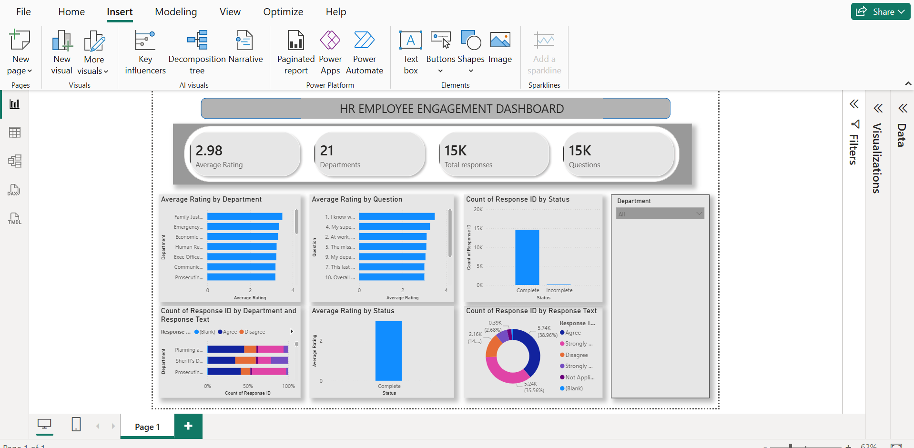

# HR-EMPLOYEE-ENGAGEMENT-DASHBOARD
Interactive Power BI dashboard analyzing HR employee engagement survey responses using DAX, Power Query, and data visualization.
# HR Employee Engagement Dashboard

## Project Overview

This project presents an interactive HR Employee Engagement Dashboard developed using Power BI. The dashboard analyzes employee engagement survey responses to provide HR teams with actionable insights into employee satisfaction, survey participation, and departmental performance.

---

## Business Problem

Employee engagement is a key driver of organizational performance and employee retention. HR departments require an efficient way to analyze employee survey responses, identify engagement trends, and recognize departments that may require additional support.

This dashboard transforms raw survey data into meaningful insights that support data-driven HR decision-making.

---

## Objectives

- Analyze employee engagement survey responses.
- Measure employee satisfaction across departments.
- Monitor survey completion rates.
- Identify engagement trends using interactive visualizations.
- Support HR decision-making through data-driven insights.

---

## Tools and Technologies

- Power BI
- Power Query
- DAX
- Microsoft Excel

---

## Dashboard KPIs

- Average Employee Rating
- Total Survey Responses
- Total Departments
- Total Survey Questions

---

## Dashboard Features

- Average Rating by Department
- Average Rating by Survey Question
- Survey Completion Status
- Response Distribution
- Department-wise Response Analysis
- Interactive Department Filter

---

## Key Insights

- The overall employee engagement rating is approximately **3.0 out of 5**.
- Survey responses were collected from **21 departments**.
- Most survey responses were completed successfully.
- The majority of employees selected **Agree** or **Strongly Agree**, indicating generally positive engagement.
- Department-level analysis highlights variations in employee satisfaction that can support targeted HR initiatives.

---

## Recommendations

- Focus on departments with below-average engagement scores.
- Conduct follow-up surveys to better understand employee concerns.
- Continue employee engagement and recognition initiatives.
- Monitor employee engagement regularly through periodic surveys.

---

## Dashboard Preview



---

## Dataset

This project uses the **Employee Survey Responses** dataset from the **Maven Analytics Data Playground**.

---

## Skills Demonstrated

- Data Cleaning
- Data Transformation
- Data Visualization
- Dashboard Design
- DAX
- Power Query
- KPI Development
- Business Analysis
- HR Analytics
- Insight Generation

---

## Repository Structure

```text
HR-Employee-Engagement-Dashboard/
│
├── README.md
├── HR-EMPLOYEE-ENGAGEMENT-DASHBOARD.pbix
└── Dashboard.png
```

---

## Future Enhancements

- Add trend analysis across multiple survey periods.
- Include demographic analysis if additional employee data becomes available.
- Develop an executive summary page with drill-through functionality.
